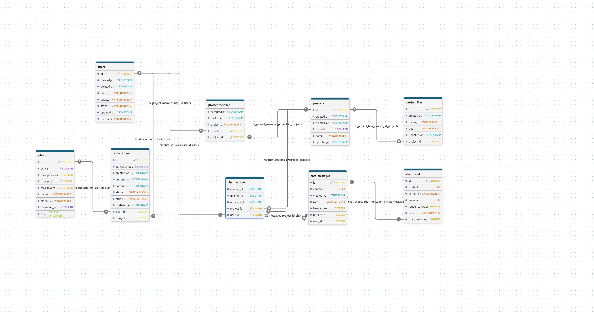

# StackGen
StackGen is an AI-powered system that generates a working application stack from a single prompt — and allows users to run their generated apps inside isolated containerized environments.

<h3>Database Schema</h3>

This is the Database Architecture

<h3>Featues</h3>

<ul>
  <li>
    <strong>AI-Powered Project Generation</strong> – Generate complete frontend applications from natural language prompts.
  </li>
  <li>
    <strong>Project-Focused AI</strong> – Designed specifically for software project generation instead of general-purpose conversations.
  </li>
  <li>
    <strong>Real-Time Streaming</strong> – View the AI's response and generated code as it is produced.
  </li>
  <li>
    <strong>Project Management</strong> – Create, organize, and manage multiple AI-generated projects.
  </li>
  <li>
    <strong>Built-in Code Viewer &amp; Editor</strong> – Browse, inspect, and edit generated project files directly within the application.
  </li>
  <li>
    <strong>Team Collaboration</strong> – Invite team members and collaborate on shared projects.
  </li>
  <li>
    <strong>Project Sharing</strong> – Share projects with collaborators for collaborative development.
  </li>
  <li>
    <strong>Live Project Preview</strong> – Run generated applications and interact with them in a live browser preview.
  </li>
  <li>
    <strong>Persistent Project Storage</strong> – Securely store project files and metadata for future access.
  </li>
  <li>
    <strong>Authentication &amp; Authorization</strong> – Secure user authentication and protect access to projects and resources.
  </li>
  <li>
    <strong>Subscription Management</strong> – Multiple subscription plans with feature access and usage management.
  </li>
</ul>

<h3>Tech Stack</h3>

<ul>
  <li><strong>Frontend:</strong> JavaScript,React, Vite, Tailwind CSS, DaisyUI</li>
  <li><strong>Backend:</strong> Java,Spring Boot</li>
  <li><strong>Database:</strong> PostgreSQL</li>
  <li><strong>Caching:</strong> Redis</li>
  <li><strong>Object Storage:</strong> MinIO</li>
  <li><strong>Containerization:</strong> Docker</li>
  <li><strong>Container Orchestration:</strong> Kubernetes (Kind)</li>
  <li><strong>Build Tools:</strong> Maven, npm</li>
  <li><strong>Authentication:</strong> JWT, Spring Security</li>
  <li><strong>AI Integration:</strong> Spring AI</li>
</ul>
